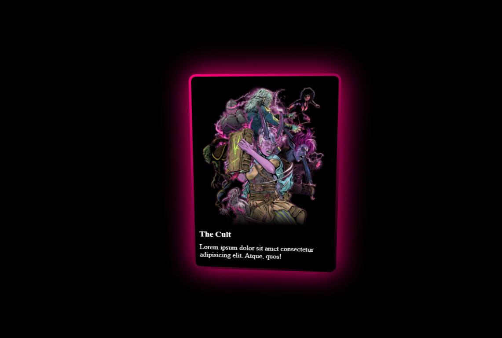

# Day 1: Interactive 3D Glow Card 🃏

A high-end UI component featuring a dynamic 3D tilt effect and a rotating glowing border, built to explore modern CSS APIs and JavaScript event tracking.

## 🚀 Live Demo

https://Ronitpatel01.github.io/100-Days-Of-Code/Day-01-3D-Glow-Card/

## 🛠️ Technical Highlights

- **CSS Houdini (@property):** Implemented to animate custom CSS variables (`--rotate`), allowing for a smooth, high-performance gradient rotation that isn't possible with standard CSS keyframes.
- **3D Perspective Logic:** Used `perspective` and `preserve-3d` to create a tactile sense of depth when the card interacts with the user.
- **Vanilla JS Tilt Engine:** Developed a script that calculates the cursor's relative position using `getBoundingClientRect()` to dynamically update `rotateX` and `rotateY` transforms.
- **Glassmorphism:** Leveraged `backdrop-filter: blur` and semi-transparent borders to maintain a clean, modern aesthetic.

## 📂 Files

- `index.html` - Semantic structure
- `style.css` - Custom properties & 3D transitions
- `script.js` - Mouse coordinate logic & math

---

_Part of my #100DaysOfCode journey. Focused on leveling up UI/UX and Frontend Engineering skills._
